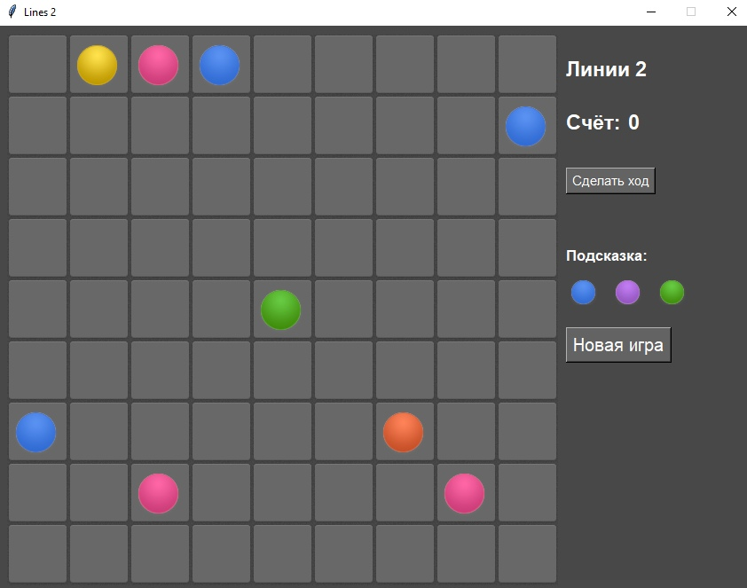
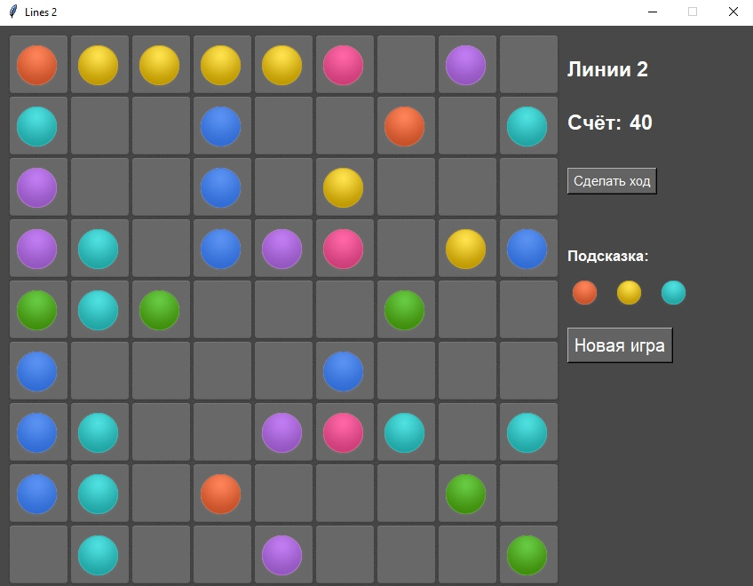
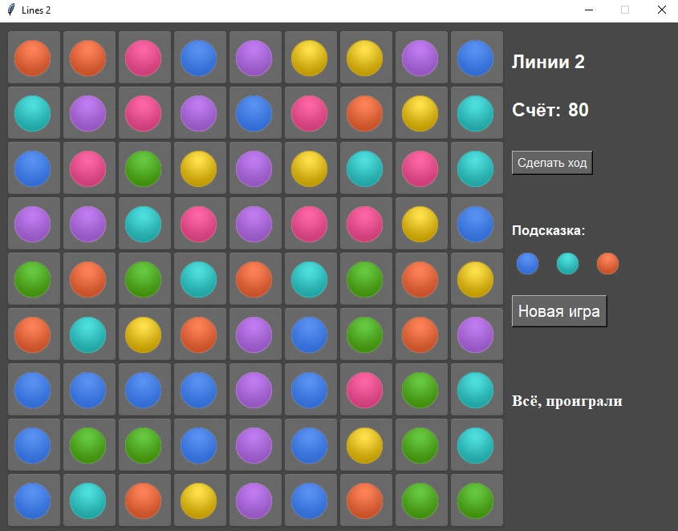

## Программирование
​Автор: Хайрова Алена
​<br><h3> Первый семестр </h3>
<p align="center">МИНИСТЕРСТВО НАУКИ  И ВЫСШЕГО ОБРАЗОВАНИЯ РОССИЙСКОЙ ФЕДЕРАЦИИ<br>
Федеральное государственное автономное образовательное учреждение высшего образования<br>
"КРЫМСКИЙ ФЕДЕРАЛЬНЫЙ УНИВЕРСИТЕТ им. В. И. ВЕРНАДСКОГО"<br>
ФИЗИКО-ТЕХНИЧЕСКИЙ ИНСТИТУТ<br>
Кафедра компьютерной инженерии и моделирования</p>
<br>
<h3 align="center">Отчёт по лабораторной работе № 3<br> по дисциплине "Программирование"</h3>
<br><br>
<p>студента 1 курса группы ИВТ-б-о-201(2)<br>
Хайровой Алены Дмитриевны<br>
направления подготовки 09.03.01 "Информатика и вычислительная техника"</p>
<br><br>
<table>
<tr><td>Научный руководитель<br> старший преподаватель кафедры<br> компьютерной инженерии и моделирования</td>
<td>(&nbsp;&nbsp;&nbsp;&nbsp;&nbsp;&nbsp;&nbsp;&nbsp;&nbsp;&nbsp;&nbsp;&nbsp;&nbsp;&nbsp;&nbsp;&nbsp;&nbsp;&nbsp;&nbsp;&nbsp;&nbsp;&nbsp;&nbsp;&nbsp;&nbsp;&nbsp;&nbsp;&nbsp;&nbsp;&nbsp;&nbsp;&nbsp;)</td>
<td>Чабанов В.В.</td>
</tr>
</table>
<br><br>
<p align="center" > Симферополь, 2020</p>
<hr>

<h2>Постановка задачи</h2>

Используя стандартный модуль для разработки программ с графическим интерфейсом Tkinter, реализуйте игру Lines на языке Python.
В качестве образца графического интерфейса была использована данная игра.

<h2>Ход работы</h2>

<h3>0. Изучение предоставленных материалов.</h3>

В первую очередь я ознакомилась с материалами по графическому интерфейсу Tkinter и библиотекой Pillow, которая используется для
подготовки и выведения графики из графических файлов (png) на виджеты Tkinter. Сложным оказалось совмещать картинки разных размеров, но благо нам с этим помогли.

Далее я изучила описанную логику игры и перешла по ссылке, чтобы ознакомиться с предоставленным образцом игры.

<h3>I. Подготовка.</h3>
Я установила библиотеку Pillow и протестировала несколько простых примеров работы с графикой, прочитала руководство по размещению элементов с
помощью метода .grid().

<h3>II. Выполнение работы.</h3>

<h4>1. Расположение элементов оформления.</h4>
С установкой элементов при помощи метода .grid() почти ничего не получалось, но потом я прочитала, что есть ещё метод .place(), который позволяет
устанавливать виджеты в произвольное место на экране. С этим методом работа пошла быстрее, т.к. все виджеты ставились, куда нужно.
Так как разрешено было не делать анимацию передвижения, то для создания всей графики мне нужны были только самые большие шары.

По представленным примерам я нарезала большие шары из всех файлов с шарами и подготовила графический комплект для выполнения игры:
двумерный массив img[][], где первым индексом идёт цвет шара (0-пустая клетка), а второй индекс указывает на: 0-большой шар с обычной клеткой,
1-большой шар с помеченной клеткой (для выбора шара) и 3-пришлось ещё вырезать маленькие шары и наложить на них фон окна - они нужны для
отображения подсказки справа. Итого получилось 21 картинка + пустое поле и всё это в массиве img.
Потом я создала поле: двумерный массив pole[y][x] и заполнила его картинками с пустыми клетками. Для каждого виджета я ещё добавила два
дополнительных атрибута: .cord - координаты, где стоит шар и .color - цвет шара (0-если нет шара).

Дополнительно я сделала массив из тёх элементов для виджетов подсказки. Всё примерно так же, как и с виджетами для pole, только картинки туда шли
маленькие из индекса 2 массива img[color][2].

Когда поле стало нормално отображаться, я попробовала разместить методом .place надписи справа, но они при изменении текста центровались
и было некрасиво и неровно. Поэтому я попробовала разместить справа элемент canvas, на котором простонарисовала текст в нужном мне месте.
Честно говоря на оформление поля и размещение всех элементов ушла большая часть времени. Но и опыт был получен большой.

<p align="center"></p>
<p align="center">Рис 1. Самое начало игры.</p>

<h4>2. Логика игры.</h4>
Я сделала основные функции игры: для рриёма кликов по клеткам поля - pole_click(), перезапуск игры - restart_game(), конец игры - end_game(),
добавление трёх новых шаров - balls_add() из шаров подсказки, генерацию трёх новых шаров подсказки - generate_hlp() и ещё несколько других.
Логика игры сводится к тому, что мы сначала рисуем поле, потом заполняем буфер шаров помощи и идёт игра.

<p align="center"></p>
<p align="center">Рис 1. Почти заполненное поле.</p>

В игре есть две фазы: игра идёт и проигрыш-игра ждёт нажатия кнопки "Новая игра". Если при появлении новых шаров места для них уже нет, то
игра переходит из стадии игры в стадию ожидания и выводит надпись о проигрыше. Именно наличие этой надписи я и сделала
 
флагом состояния игры:
если надписи нет, игра идёт, есть - ждёт. Получился вполне рабочий вариант.

<p align="center"></p>
<p align="center">Рис 1. Проигрыш. Игра в фазе ожидания.</p>

Важным моментом игры было определить, если возможность перекатить шар на другую позицию. Для этого я использовала рекурсивный алгоритм путепоиска,
когда из каждой новой клетки появляются ещё другие клетки. Есть общий set() занятых позиций на поле и алгоритм постоянно добавляет в этот сет данные о том,
что ещё теперь уже занято. Такой алгоритм работает достаточно быстро, но, увы, не возвращает пути, по которому он от начала поиска добрался до его конца.
Может быть я его переделаю немного позже.

Второй важный алгоритм это алгоритм поиска образовавшихся линий после переката шара - line_check(point). Подробно я его расписал в комментария в коде игры.
Скажу лишь, что он работает по принципу 4-х направлений: горизонтальная, вертикальная и две диагональные линии. Заведомо, сначала
изменяет координаты поиска так, чтобы они находились за пределами поля, чтобы обязательно захватить все клетки поля. И потом изменяет
коорбинаты поиска в направлении своего вектора. Все шары по каждому из направлений собираются отдельно и поэтому потом
можно удалить сразу все линии, например, если шар "закрыл" сразу две или три линии. Это так же как в представленном образце игры.

<p><br>Привожу полный код игры "Lines 2":</p>

```python
import random as rnd 
from tkinter import *
from PIL import Image, ImageTk

game=[]
select=None
podskazka=[]
schet=0
gameend=""

def pf(destination):
    global game, select
    empty   = set([(x, y) for y in range(len(game)) for x in range(len(game[y])) if game[y][x].color==0])
    tracks   = [[select.cord]]
    while tracks:
        add_tracks=[]
        for track in tracks:
            cx, cy = track[-1][0], track[-1][1]
            add_dots=set([(cx+1, cy), (cx-1, cy), (cx, cy+1), (cx, cy-1)]) & empty
            if destination in add_dots:
                return track + [destination]
            empty -= add_dots
            add_tracks += [track + [dot] for dot in add_dots]
        tracks = add_tracks
    return []

def check_lines5():
    global game

    for clr in range(1,8):
        del_balls=[]
        for x in range(0,9): # по вертикальним поиск
            for y in range(0,9):
                if game[y][x].color==clr: del_balls.append((x,y))
                else: del_balls=[]
                if len(del_balls)>=5: return del_balls

        for y in range(0,9): # по горизонтальным поиск
            for x in range(0,9):
                if game[y][x].color==clr: del_balls.append((x,y))
                else: del_balls=[]
                if len(del_balls)>=5: return del_balls

        for y in range(-4,5): # по \
            x=0
            y1=y
            for i in range(10):
                if 0<=x<9 and 0<=y1<9:
                    if game[y1][x].color==clr: del_balls.append((x,y1))
                    else: del_balls=[]
                    if len(del_balls)>=5: return del_balls
                x+=1
                y1+=1

        for y in range(4,13): # по /
            x=0
            y1=y
            for i in range(10):
                if 0<=x<9 and 0<=y1<9:
                    if game[y1][x].color==clr: del_balls.append((x,y1))
                    else: del_balls=[]
                    if len(del_balls)>=5: return del_balls
                x+=1
                y1-=1
    return []

def check():
    global game, count, schet
    have_line5=check_lines5()
    if have_line5:
        for i in have_line5:
            game[i[1]][i[0]].color = 0
            game[i[1]][i[0]].configure(image=picts[0][0])

        schet+=10
        Canv.delete(count)
        count=Canv.create_text(710,95, text=str(schet), font="Helvetica 17 bold", fill="white", anchor=NW)
        Canv.update()
        return True
    return False


def restart_game(*args, **kargs):
    global gameend, game, count, select

    Canv.delete(count)
    count=Canv.create_text(710,95, text=str(schet), font="Helvetica 17 bold", fill="white", anchor=NW)
    Canv.update()

    if gameend!="":
        Canv.delete(gameend)
        gameend=""
    for x in range(9):
        for y in range(9):
            game[y][x].color=0
            game[y][x].configure(image=picts[0][0])
    if select:
        game[select.cord[1]][select.cord[0]].configure(image=picts[select.color][0])
        select=None
    add_3_balls()

def get_free_cells():
    result=[]
    for i in range(9):
        for j in range(9):
            if game[j][i].color==0:
                result.append(game[j][i].cord)
    return result

def add_3_balls(*args, **kargs):
    global gameend, game, select
    if gameend!="": return
    if select:
        game[select.cord[1]][select.cord[0]].configure(image=picts[select.color][0])
        select=None
    for i in range(3):
        free=get_free_cells()
        xp,yp=free[rnd.randint(0,len(free)-1)]
        game[yp][xp].color = podskazka[i].color
        game[yp][xp].configure(image=picts[game[yp][xp].color][0])
        check()
        if not get_free_cells():
            Canv.delete(gameend)
            gameend=Canv.create_text(640,460, text='Всё, проиграли', anchor=NW, font="Times 15 bold", fill="white")
            return
    for i in range(3):
        podskazka[i].color=rnd.randint(1,7)
        podskazka[i].configure(image=picts[podskazka[i].color][-1])

def game_click(event):
    global game, select
    if gameend!="":
        return

    x,y=event.widget.cord
    if event.widget.color:
        if select:
            game[select.cord[1]][select.cord[0]].configure(image=picts[select.color][0])
            select=None
        game[y][x].configure(image=picts[event.widget.color][1])
        select=event.widget;
        return

    if not event.widget.color and not select:
        return

    if not pf((x,y)):
        return

    game[y][x].color = select.color
    game[y][x].configure(image=picts[select.color][0])


    x1,y1=select.cord
    game[y1][x1].color = 0
    game[y1][x1].configure(image=picts[0][0])
    select=None
    if not check():
        add_3_balls()

root = Tk()
root.title("Lines 2")
root.geometry('850x635+200+100')
root.resizable(0, 0)

Canv=Canvas(root, width='850', height='635', bd=0, highlightthickness=0, relief='ridge', bg="#484848");
Canv.place(x=0,y=0)

Canv.create_text(640,35, text='Линии 2', font="Helvetica 17 bold", fill="white", anchor=NW)
Canv.create_text(640,95, text='Счёт:', font="Helvetica 17 bold", fill="white", anchor=NW)
count=Canv.create_text(710,900, text='00', font="Helvetica 17 bold", fill="white", anchor=NW)

NextTurn=Button(root, text="Сделать ход", font="Helvetica 11", bg="#636363", fg='white')
NextTurn.bind("<Button-1>", add_3_balls)
NextTurn.place(x=640,y=160)

Canv.create_text(640,250, text='Подсказка:', anchor=NW, font="Helvetica 13 bold", fill="white")
NewGame=Button(root, text="Новая игра", font="Helvetica 15", bg="#636363", fg='white')
NewGame.bind("<Button-1>", restart_game)
NewGame.place(x=640,y=340)

fon_c   = Image.open("cell-bgr.png")
empty   = fon_c.crop((0, 0,69, 69)).convert('RGBA')

empty_s = Image.open("fon_small_ball.png").crop((0,0,35,35)).convert('RGBA')

sel     = fon_c.crop((0,69,69,138)).convert('RGBA')
picts=[[ImageTk.PhotoImage(empty), ImageTk.PhotoImage(empty_s)]]
pic_size_same_as_bgr   = Image.new("RGBA", (69,69))
pic_size_same_as_bgr_s = Image.new("RGBA", (35,35))
for image_filename in ['aqua','blue','green','pink','red','violet','yellow']:
    picts.append([])
    ball_picts=Image.open('ball-'+image_filename+'.png')

    ball=ball_picts.crop((0,0,55,57)).convert('RGBA')
    ball_over_bgr = Image.alpha_composite(empty, pic_size_same_as_bgr)
    ball_over_bgr.paste(ball, (5,7), ball)
    picts[-1].append(ImageTk.PhotoImage(ball_over_bgr))

    ball_over_bgr = Image.alpha_composite(sel, pic_size_same_as_bgr)
    ball_over_bgr.paste(ball, (5,7), ball)
    picts[-1].append(ImageTk.PhotoImage(ball_over_bgr))

    ball=ball_picts.crop((13, 57*3+23, 50,57*4)).convert('RGBA')
    ball_over_bgr = Image.alpha_composite(empty_s, pic_size_same_as_bgr_s)
    ball_over_bgr.paste(ball, (5,7), ball)
    picts[-1].append(ImageTk.PhotoImage(ball_over_bgr))
game=[]
for y in range(9):
    game.append([])
    for x in range(9):
        game[y].append(Label(root, image = picts[0][0], bd=0))
        game[y][x].bind("<Button-1>", game_click)
        game[y][x].cord = (x,y)
        game[y][x].color = 0
        game[y][x].place(x=x*69+10, y=y*69+10)
podskazka=[]
for i in range(3):
    clr=rnd.randint(1,7)
    podskazka.append(Label(root, image = picts[clr][2], bd=0))
    podskazka[i].color = clr
    podskazka[i].place(x=640+i*50, y=280)

add_3_balls()
root.mainloop()

```

<h2>Вывод</h2>
В ходе работы я познакомилась со стандартной графической библиотекой Tkinter и графической библиотекой Pillow.
Благодаря этому я смогу при необходимости создать интерфейс графического приложения для каких-то своих нужд.
Для выполнения работы, кроме материалов, предоставленных научным руководителем, пришлось посмотреть и изучить дополнтельно несколько
видеокурсов на эти темы. Работа была и интересной и полезной.
